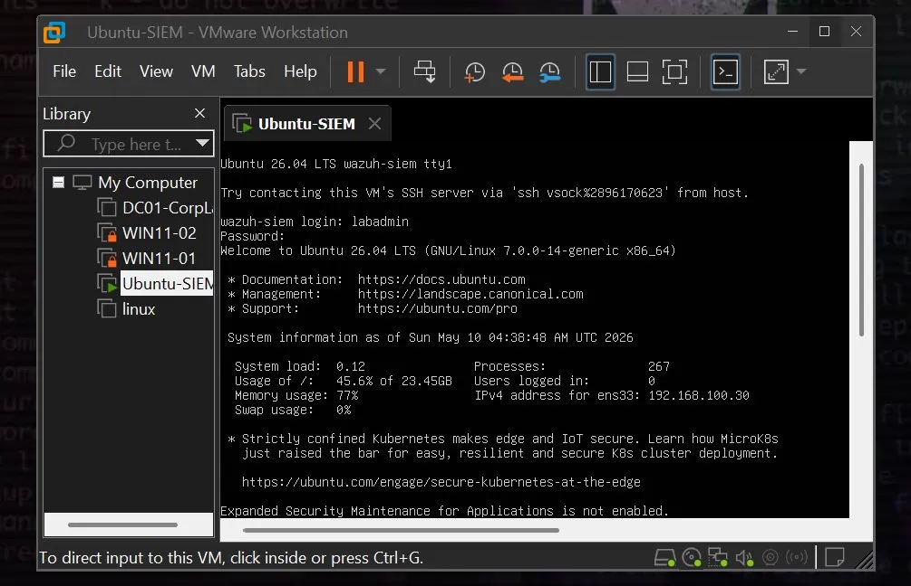
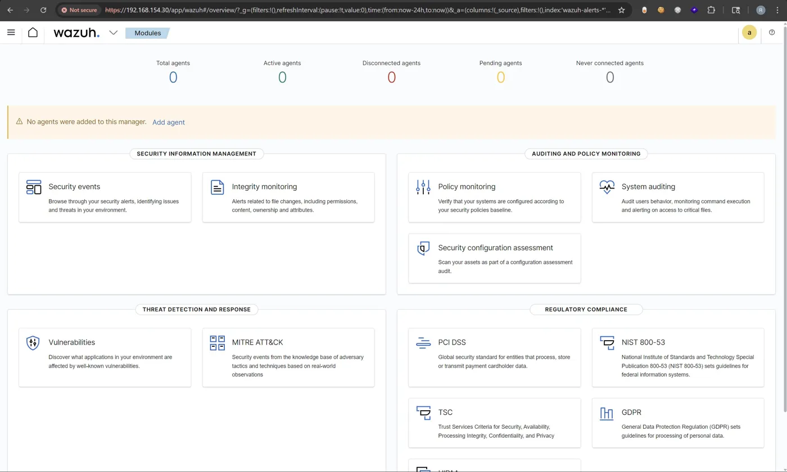
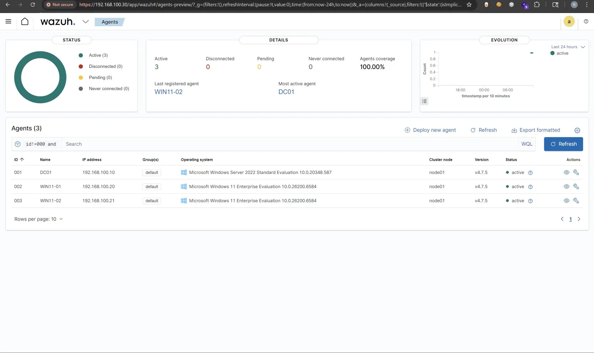
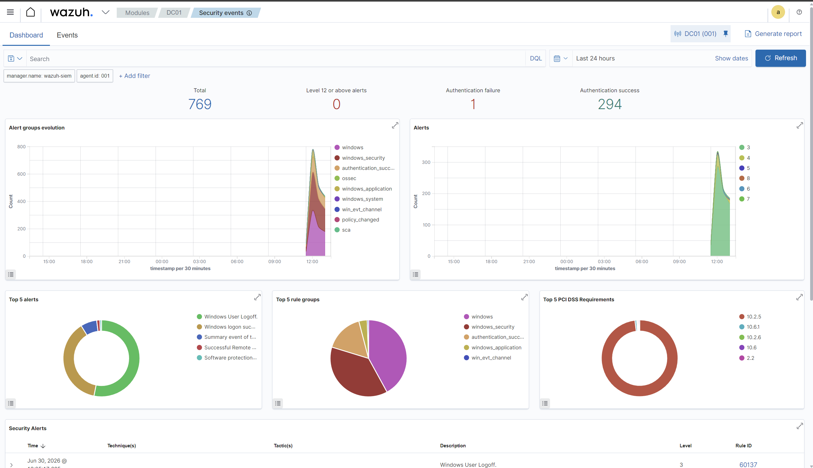
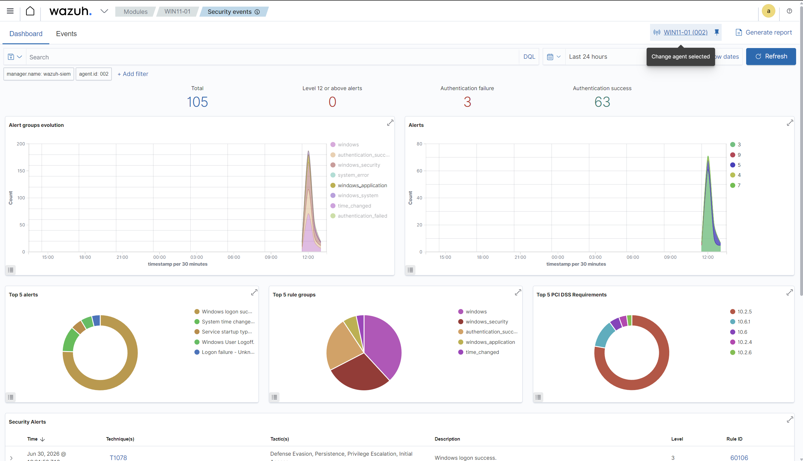
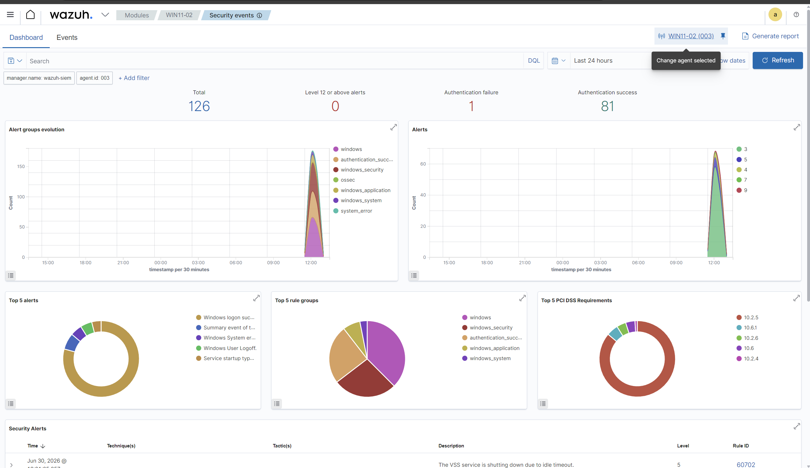
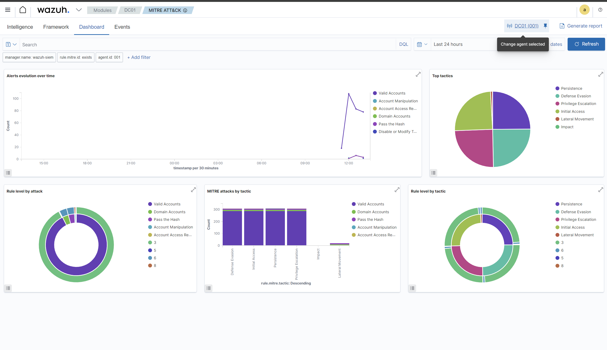
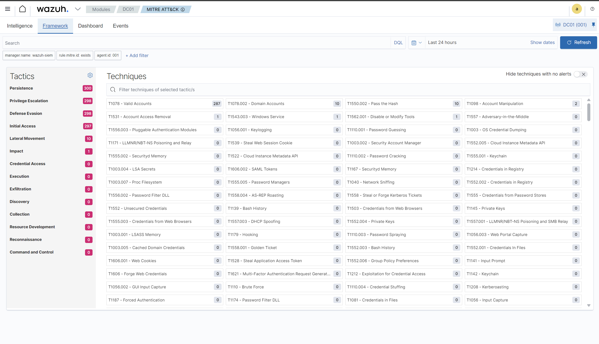
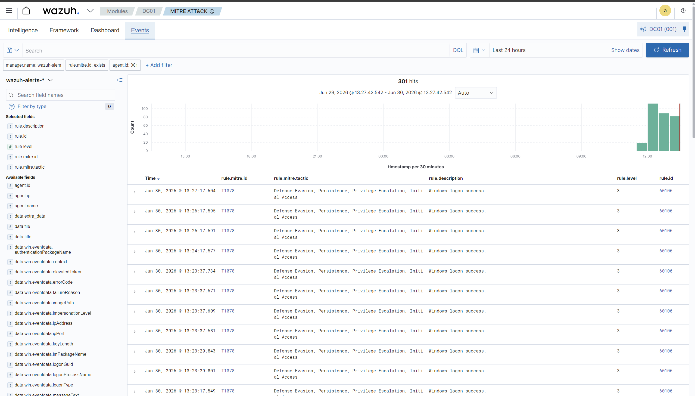

# Active Directory Threat Detection & SIEM Monitoring Lab

A self-built enterprise security operations lab simulating a real corporate Active Directory environment — with a full Windows domain, endpoint telemetry pipeline, and a Wazuh SIEM used to detect, alert on, and investigate real attack techniques mapped to MITRE ATT&CK.

> This is not a tutorial walkthrough. Every machine, user, detection rule, and incident report in this repository was built, attacked, and investigated end to end on local hardware.

---

## Architecture

All machines run as VMs on VMware Workstation Pro across two physical hosts, networked through an isolated host-only VMware subnet (`192.168.100.0/24`) with no internet egress except during package installation.

---

## Environment

| Component | Technology | IP Address | Role |
|---|---|---|---|
| Domain Controller | Windows Server 2022 | 192.168.100.10 | Active Directory, DNS, Kerberos |
| Workstation 1 | Windows 11 Enterprise | 192.168.100.20 | Domain-joined endpoint |
| Workstation 2 | Windows 11 Enterprise | 192.168.100.21 | Domain-joined endpoint |
| Linux victim | Ubuntu 24.04 Desktop | 192.168.100.40 | SSH/Apache exposed service |
| SIEM | Wazuh 4.7.5 (Manager, Indexer, Dashboard) | 192.168.100.30 | Log aggregation, detection, alerting |
| Attacker | Kali Linux | 192.168.100.50 | Adversary simulation |

Endpoint telemetry is captured via **Sysmon** (SwiftOnSecurity config) on all Windows hosts and forwarded to Wazuh through the Wazuh agent. All hosts are domain-joined or domain-adjacent to simulate a realistic small enterprise network.

---

## Active Directory Configuration

- **Domain:** `corp.local`
- **Organisational Units:** IT, Finance, HR
- **Standard users:** `bob.finance`, `carol.hr`
- **Privileged user:** `alice.admin` (Domain Admins)
- **Service account:** `svc-backup` (SPN-registered — intentional Kerberoasting target)

---

## Agent Coverage

100% agent coverage across all endpoints. DC01 (192.168.100.10), WIN11-01 (192.168.100.20), and WIN11-02 (192.168.100.21) all reporting active on Wazuh v4.7.5. Every Windows host ships Sysmon logs (process creation, network connections, file events) in addition to native Windows Security Event Log.

---

## Attack Scenarios Documented

| # | Technique | MITRE ATT&CK ID | Detected | Write-up |
|---|---|---|---|---|
| 1 | Network service discovery (Nmap) | T1046 | ✅ Yes | [01-network-reconnaissance](attack-scenarios/01-network-reconnaissance) |
| 2 | Password spraying / brute force | T1110.003 | ✅ Yes | [02-password-spray](attack-scenarios/02-password-spray) |
| 3 | Kerberoasting | T1558.003 | ✅ Yes | [03-kerberoasting](attack-scenarios/03-kerberoasting) |

Each scenario folder contains the exact attacker commands run from Kali, the resulting Wazuh alert, the rule that fired, and a short explanation of why the technique works and what the detection actually catches.

---

## MITRE ATT&CK Integration & SIEM Dashboards

Wazuh maps ingested endpoint security events directly to the MITRE ATT&CK framework in real time, giving analysts a visual breakdown of active tactics and techniques in the environment.

### 1. Active Directory Domain Controller (`DC01`) Security Events
A high volume of telemetry was ingested from `DC01`, registering 769 security events, including successful logons and service ticket requests:

### 2. Workstation Security Events
Dashboards for the domain workstations `WIN11-01` (105 events) and `WIN11-02` (126 events) showing telemetry collection across the enterprise network:

*WIN11-01 endpoint telemetry*

*WIN11-02 endpoint telemetry*

### 3. MITRE ATT&CK Triage Matrix
The Wazuh MITRE ATT&CK module categorises active detections by tactic, showing hits across Initial Access, Persistence, Privilege Escalation, Defense Evasion, and Lateral Movement:

*Tactics breakdown and event counts*

*Matrix view showing specific techniques triggered in the lab*

*Chronological event feed with associated MITRE IDs (e.g. T1078 Valid Accounts)*

---

## Detection Engineering

Custom detection logic written in **Sigma format** (vendor-neutral, portable to Splunk/Elastic/Wazuh) lives in [`detection-rules/`](detection-rules). Rules are validated against live attack traffic generated in this lab, not theoretical traffic.

| Rule | Technique | File |
|---|---|---|
| Kerberoasting via RC4 Ticket Request | T1558.003 | [kerberoasting.yml](detection-rules/kerberoasting.yml) |
| Password Spray via Repeated SMB Logon Failures | T1110.003 | [password-spray.yml](detection-rules/password-spray.yml) |

---

## Incident Reports

[`incident-reports/`](incident-reports) contains a full incident response write-up for the Kerberoasting scenario, formatted the way a SOC analyst would document a real investigation: timeline, evidence, root cause, and remediation recommendations.

- [INC-2026-003 — Kerberoasting (High Severity)](incident-reports/INC-2026-003-kerberoasting.md)

---

## Tools Used

`Wazuh` · `Sysmon` · `VMware Workstation Pro` · `Nmap` · `CrackMapExec` · `Impacket` · `Hydra` · `BloodHound` · `Sigma` · `MITRE ATT&CK Navigator`

---

## Why This Exists

Built as a practical companion to certification study and self-directed learning — to develop hands-on familiarity with SIEM operations, Active Directory attack paths, and detection engineering before entering SOC analyst / blue team roles.
