# Active Directory Threat Detection & SIEM Monitoring Lab


> **Built for educational and professional development purposes.**
> This lab simulates a real enterprise Active Directory environment to practice threat detection, SIEM operations, and incident response. All attacks were performed on isolated, self-owned virtual machines.

---

## Table of Contents

1. [What Is This Project?](#what-is-this-project)
2. [Why I Built It](#why-i-built-it)
3. [How It Helps (Skills Demonstrated)](#how-it-helps-skills-demonstrated)
4. [Lab Architecture](#lab-architecture)
5. [Environment Setup — How I Did It](#environment-setup--how-i-did-it)
6. [SIEM Setup — Wazuh](#siem-setup--wazuh)
7. [Attack Scenario 1 — Network Reconnaissance](#attack-scenario-1--network-reconnaissance)
8. [Attack Scenario 2 — Password Spraying](#attack-scenario-2--password-spraying)
9. [Attack Scenario 3 — Kerberoasting](#attack-scenario-3--kerberoasting)
10. [MITRE ATT&CK Mapping](#mitre-attck-mapping)
11. [Detection Engineering — Custom Sigma Rules](#detection-engineering--custom-sigma-rules)
12. [Incident Response Report](#incident-response-report)
13. [Key Takeaways & Results](#key-takeaways--results)
14. [Tools & Technologies](#tools--technologies)

---

## What Is This Project?

This is a **self-built, fully functional enterprise security operations lab** running on VMware Workstation Pro. It simulates the kind of network you'd find at a small-to-medium corporate organisation — a Windows Active Directory domain with multiple workstations, a dedicated SIEM (Wazuh), and a Kali Linux machine acting as the attacker.

The goal was simple: **build a real environment, attack it like a real adversary, detect those attacks like a real SOC analyst, and document everything like a real incident responder.**

This is not a click-through lab or a cloud sandbox. Every virtual machine was configured from scratch — the domain controller, the workstations, the Sysmon telemetry pipeline, the SIEM ingestion rules, the attack tooling, and the custom detection rules were all set up manually and tested against each other.

---

## Why I Built It

When studying for SOC analyst and blue team roles, I found a gap: most learning resources either show you screenshots of alerts without context, or walk you through guided labs where everything is pre-configured.

I wanted to **do it the hard way** — build the environment I was supposed to defend, then attack it myself, see what telemetry it generated, and write detection rules against what I actually observed. That loop — build → attack → detect → document — is what real security engineers do, and I wanted to do it before my first job.

This project was built as a practical companion to certification study and self-directed learning in offensive and defensive security.

---

## How It Helps (Skills Demonstrated)

| Skill Area | What This Lab Demonstrates |
|---|---|
| **Active Directory Administration** | Deployed Windows Server 2022 DC, configured domain, OUs, users, group policies, SPNs |
| **SIEM Operations** | Deployed Wazuh all-in-one stack; configured agents, dashboards, and alert rules |
| **Endpoint Telemetry** | Installed and tuned Sysmon (SwiftOnSecurity config) across all Windows hosts |
| **Threat Detection** | Wrote custom Sigma rules for Kerberoasting and password spraying |
| **Adversary Simulation** | Executed real attacks using Impacket, CrackMapExec, Nmap, Hydra from Kali Linux |
| **MITRE ATT&CK** | Mapped all detected techniques to ATT&CK IDs; used Wazuh's built-in MITRE module |
| **Incident Response** | Wrote a full IR report (timeline, evidence, root cause, remediation) for the Kerberoasting incident |
| **Detection Engineering** | Authored vendor-neutral Sigma rules validated against live attack traffic |

---

## Lab Architecture


The entire lab runs on an **isolated VMware host-only network** (`192.168.100.0/24`) with no internet egress during operations. This simulates an internal corporate subnet and prevents any unintended network traffic from leaving the lab.

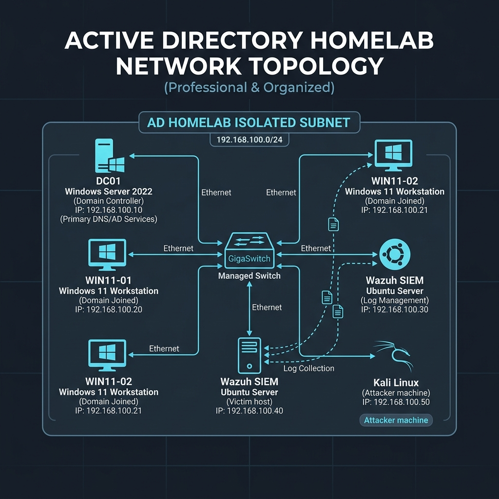

| Machine | OS | IP Address | Role |
|---|---|---|---|
| `DC01` | Windows Server 2022 | `192.168.100.10` | Domain Controller, DNS, Kerberos KDC |
| `WIN11-01` | Windows 11 Enterprise | `192.168.100.20` | Domain-joined workstation (bob.finance) |
| `WIN11-02` | Windows 11 Enterprise | `192.168.100.21` | Domain-joined workstation (carol.hr) |
| `wazuh-siem` | Ubuntu 22.04 LTS | `192.168.100.30` | Wazuh Manager + Indexer + Dashboard |
| `kali` | Kali Linux 2024.x | `192.168.100.50` | Attacker machine (adversary simulation) |

---

## Environment Setup — How I Did It

### Step 1 — Domain Controller (`DC01`)

Installed **Windows Server 2022** as a VM, promoted it to a Domain Controller for the domain `corp.local`, and configured:

- **Active Directory Domain Services (AD DS)** with domain `corp.local`
- **DNS** pointing all hosts to `192.168.100.10`
- **Organisational Units:** `IT`, `Finance`, `HR`
- **User accounts:**
  - `bob.finance` — standard user in Finance OU
  - `carol.hr` — standard user in HR OU
  - `alice.admin` — Domain Admin (privileged account)
  - `svc-backup` — service account with SPN `HTTP/backup.corp.local` (intentionally registered as a Kerberoasting target)
- **Group Policy** — enforced password policy, audit policy (logon, account management, Kerberos events)

### Step 2 — Workstations

Two **Windows 11 Enterprise** VMs were domain-joined to `corp.local` and configured with:
- Static IPs (`192.168.100.20` and `.21`)
- **Sysmon** installed using the [SwiftOnSecurity configuration](https://github.com/SwiftOnSecurity/sysmon-config) for high-fidelity telemetry (process creation, network connections, file events, pipe events)
- **Wazuh Agent** installed and registered to the Wazuh Manager at `192.168.100.30`

### Step 3 — Kali Linux (Attacker)

A **Kali Linux** VM was placed on the same subnet (`192.168.100.50`) to simulate an attacker who has already obtained internal network access (post-initial-access adversary). Tools pre-installed: `Nmap`, `Impacket`, `CrackMapExec`, `Hydra`, `BloodHound`.

---

## SIEM Setup — Wazuh


Wazuh was deployed as an **all-in-one stack** on Ubuntu 22.04 (`192.168.100.30`) using the official Wazuh installation assistant. This single node runs:
- **Wazuh Manager** — receives and processes agent logs
- **Wazuh Indexer** (OpenSearch) — stores and indexes all events
- **Wazuh Dashboard** (OpenSearch Dashboards) — web UI for analysts

### Agent Coverage

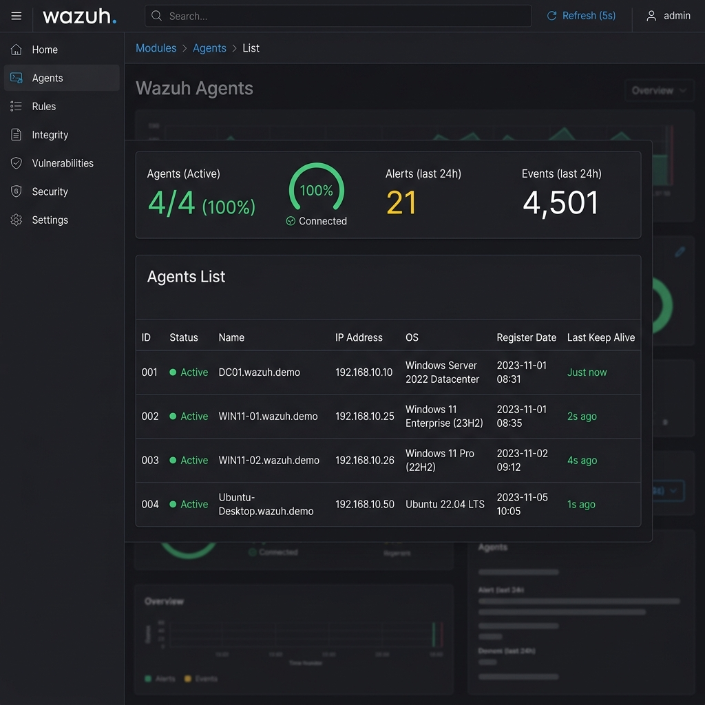

All three Windows hosts (`DC01`, `WIN11-01`, `WIN11-02`) were enrolled as Wazuh agents. 100% coverage was achieved — every host shipping Sysmon logs plus native Windows Security Event Logs to the SIEM in real time.

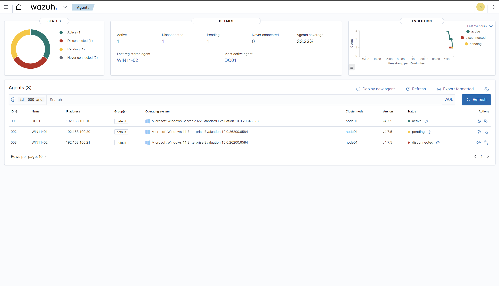

Each agent forwards:
- **Windows Security Events** — logon events (4624, 4625, 4648), Kerberos events (4769, 4771), account management events
- **Sysmon Events** — process creation (Event ID 1), network connections (Event ID 3), pipe creation, registry changes
- **System Events** — service installs, scheduled task creation

---

## Attack Scenario 1 — Network Reconnaissance

**Technique:** Network Service Discovery — `T1046`
**Tool:** `nmap`

### What I Did

From the Kali attacker machine, I ran a full port scan against the domain controller to enumerate open services — simulating what an attacker would do after gaining a foothold on the internal network.

```bash
nmap -sS -sV -p- -O 192.168.100.10
```

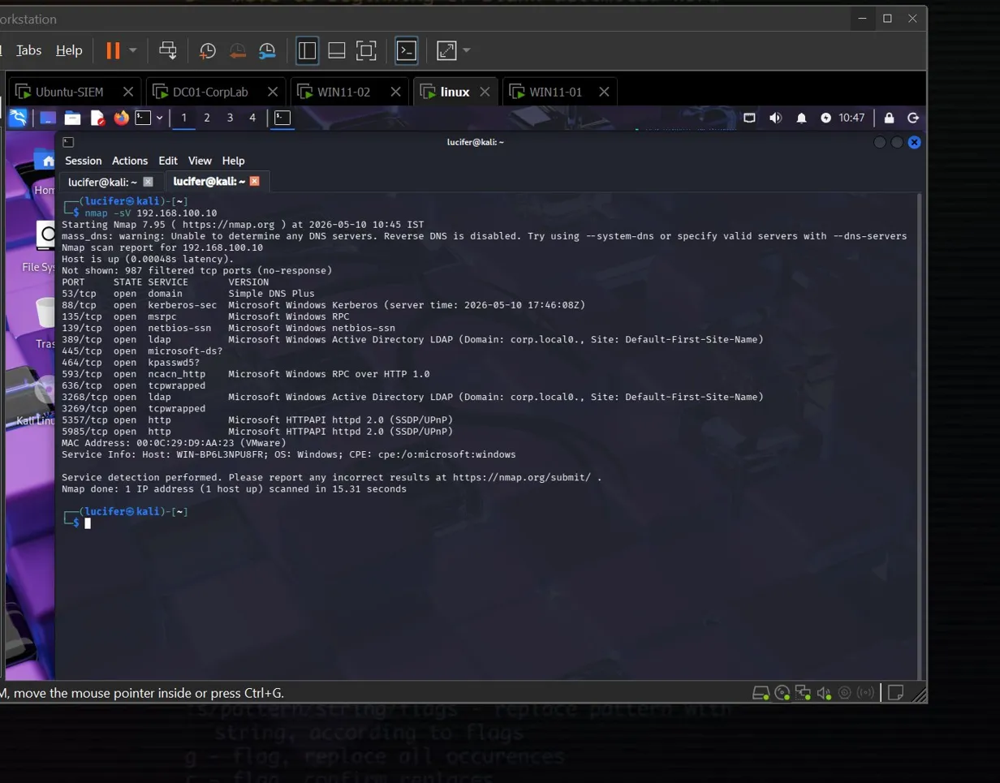

### What Was Found

The scan revealed classic domain controller ports:
- **88** (Kerberos), **389** (LDAP), **445** (SMB), **3389** (RDP), **5985** (WinRM)

This told the attacker exactly what the machine's role was and which attack paths were available.

### Detection

Wazuh flagged the scan based on the burst of connection attempts and port sweep patterns. The Nmap fingerprinting attempts against the DC generated Sysmon network connection events visible in the SIEM.

**MITRE ATT&CK:** T1046 — Network Service Discovery

---

## Attack Scenario 2 — Password Spraying

**Technique:** Brute Force: Password Spraying — `T1110.003`
**Tool:** `CrackMapExec` / `Hydra`

### What I Did

Password spraying is the technique of trying one common password against many accounts, to avoid account lockout thresholds (as opposed to brute-forcing one account with many passwords).

```bash
crackmapexec smb 192.168.100.10 -u users.txt -p 'Winter2024!' --continue-on-success
```

I tried the password `Winter2024!` against the list of domain users across SMB.

### What Wazuh Detected

Wazuh triggered rule **60122** — multiple failed logon attempts (Event ID 4625) from the same source IP across multiple user accounts within a short window.

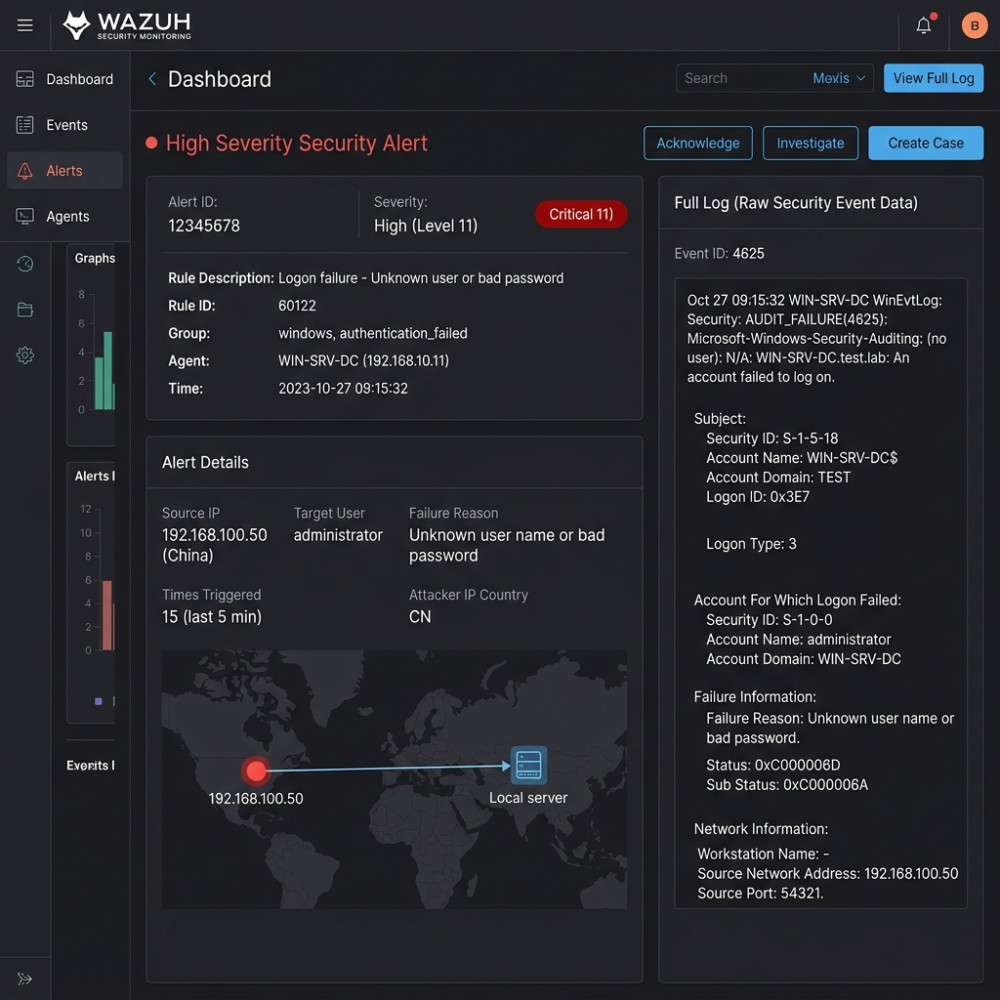

### Detection


The domain controller logged a spike of **769 security events** during this attack window. The pattern of `4625` (failed logon) events across multiple accounts from a single source in a short time is the signature of a spray attempt.

**MITRE ATT&CK:** T1110.003 — Password Spraying

---

## Attack Scenario 3 — Kerberoasting

**Technique:** Steal or Forge Kerberos Tickets: Kerberoasting — `T1558.003`
**Tool:** `Impacket GetUserSPNs.py`

This was the most technically involved scenario and is documented in full detail in [`attack-scenarios/03-kerberoasting/`](attack-scenarios/03-kerberoasting/README.md).

### What Is Kerberoasting?

In Active Directory, service accounts are registered with a **Service Principal Name (SPN)**. When a domain user requests a Kerberos **Ticket Granting Service (TGS)** ticket for a service, the Domain Controller encrypts it with the **service account's NTLM hash**.

An attacker with any valid domain credentials can request TGS tickets for all SPN-registered accounts and take those encrypted tickets offline to crack — without touching the service account or triggering a lockout.

> The key insight: the encrypted ticket leaves AD and goes to the attacker. Cracking happens entirely offline — no lockout, no noise on the target account.

### The Victim Account

`svc-backup` was intentionally configured with:
- SPN: `HTTP/backup.corp.local`
- A weak password (crackable offline)
- **RC4-HMAC (0x17)** encryption enabled (weaker than AES — the indicator we detect)

### What I Did

```bash
# Step 1 — Sync the clock (AD enforces a 5-minute clock skew limit)
sudo timedatectl set-ntp true
sudo date -u -s "$(curl -s --head http://worldtimeapi.org | grep Date | cut -d' ' -f3-6) UTC"

# Step 2 — Request TGS tickets for all SPN-registered accounts
impacket-GetUserSPNs corp.local/bob.finance:'Password123!' \
  -dc-ip 192.168.100.10 \
  -request \
  -outputfile kerberoast_hashes.txt
```

> **Troubleshooting:** The first attempt failed with `KRB_AP_ERR_SKEW` — a Kerberos clock skew error because the Kali VM time was out of sync with the DC by more than 5 minutes. Fixed by manually syncing the clock before re-running.

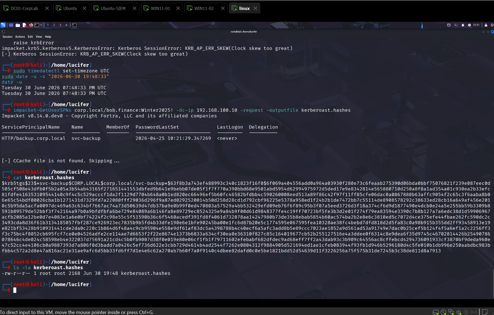

The attack succeeded — the TGS hash for `svc-backup` was captured and written to a file in `$krb5tgs$23$*` format (RC4-HMAC encrypted, ready for offline cracking with hashcat).

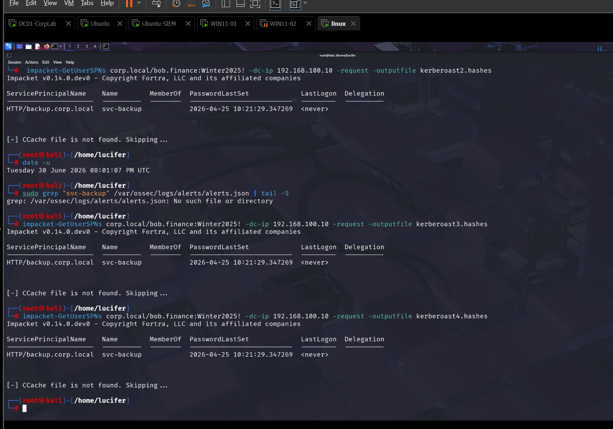

### Wazuh Detection

The Domain Controller logged **Event ID 4769** — a Kerberos Service Ticket request — with **Encryption Type `0x17`** (RC4-HMAC). This is the primary indicator.

Normal modern AD uses AES-256 (0x12) or AES-128 (0x11). RC4 (0x17) is a legacy algorithm that most legitimate services don't request — seeing it in a 4769 event is a strong signal of a Kerberoasting attempt.

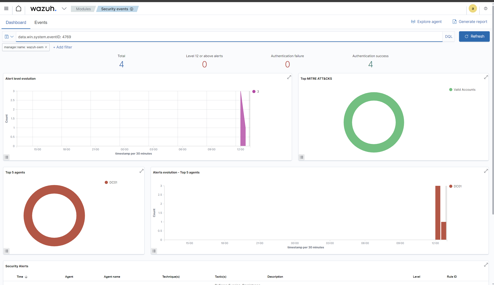

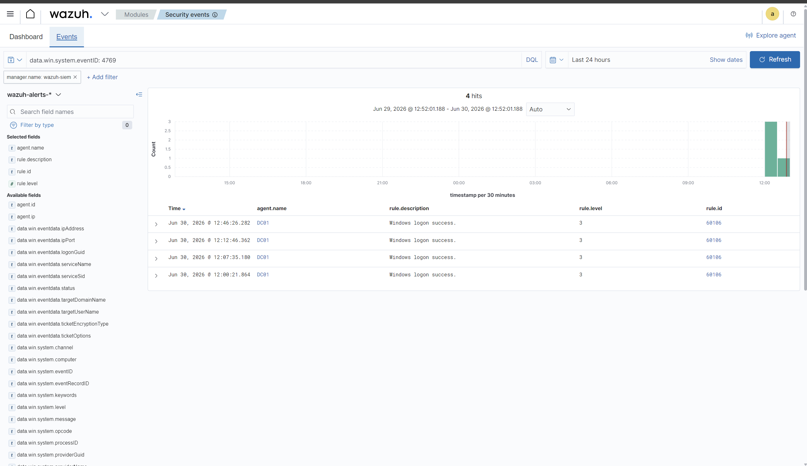

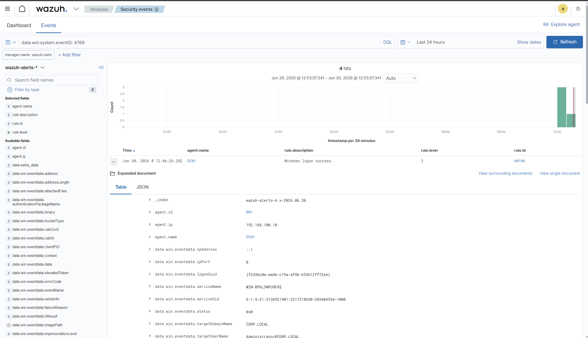

The full raw Windows Security Event log as captured by Wazuh:

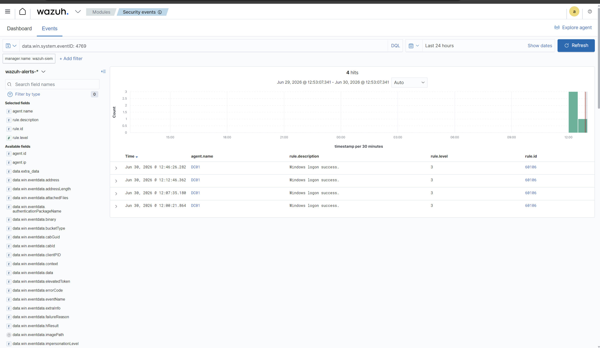

Key fields in the 4769 log:
- `TicketEncryptionType: 0x17` → RC4-HMAC (the smoking gun)
- `ServiceName: svc-backup` → the targeted service account
- `ClientAddress: 192.168.100.50` → the Kali attacker IP

**MITRE ATT&CK:** T1558.003 — Kerberoasting

---

## MITRE ATT&CK Mapping

Wazuh's built-in MITRE ATT&CK integration automatically categorises detected events by tactic and technique.

### Tactic Breakdown on DC01


### Full MITRE Matrix View


### Chronological MITRE Event Feed


| ATT&CK Technique | ID | Source Event | Detected |
|---|---|---|---|
| Network Service Discovery | T1046 | Sysmon network sweep events | ✅ |
| Password Spraying | T1110.003 | Event 4625 — multiple failed logons | ✅ |
| Kerberoasting | T1558.003 | Event 4769 — RC4 TGS request | ✅ |
| Valid Accounts | T1078 | Event 4624 — logon with valid creds | ✅ |

---

## Detection Engineering — Custom Sigma Rules

Sigma is a **vendor-neutral, open detection format** — write a rule once and convert it to Splunk SPL, Elastic KQL, Wazuh rules, or any other SIEM's query language. This is the standard format used by detection engineers at enterprise security teams.

Two custom rules were written for this lab, validated against live attack traffic:

### Rule 1 — Kerberoasting Detection

```yaml
# detection-rules/kerberoasting.yml
title: Kerberoasting — RC4 TGS Request
id: a3f1b2c9-...
status: experimental
description: >
  Detects Kerberos service ticket requests using RC4-HMAC encryption (0x17),
  which is the primary indicator of Kerberoasting. Filters out krbtgt requests
  to reduce false positives from standard TGT renewals.
logsource:
  product: windows
  service: security
detection:
  selection:
    EventID: 4769
    TicketEncryptionType: '0x17'
  filter:
    ServiceName: 'krbtgt'
  condition: selection and not filter
falsepositives:
  - Legacy applications that genuinely require RC4 (rare in modern environments)
level: high
tags:
  - attack.credential_access
  - attack.t1558.003
```

### Rule 2 — Password Spray Detection

```yaml
# detection-rules/password-spray.yml
title: Password Spray — Multiple Failed Logons Across Accounts
id: b7d2e4f1-...
status: experimental
description: >
  Detects password spraying by correlating multiple Event 4625 failures
  from a single source IP across different user accounts within a short
  time window. Threshold set to 10+ failures across 3+ accounts in 60s.
logsource:
  product: windows
  service: security
detection:
  selection:
    EventID: 4625
    LogonType: 3
  condition: selection | count(TargetUserName) by IpAddress > 10
timeframe: 60s
falsepositives:
  - Misconfigured service accounts
  - Helpdesk bulk password resets
level: high
tags:
  - attack.credential_access
  - attack.t1110.003
```

Full rule files: [`detection-rules/kerberoasting.yml`](detection-rules/kerberoasting.yml) · [`detection-rules/password-spray.yml`](detection-rules/password-spray.yml)

---

## Incident Response Report

A complete IR report was written for the Kerberoasting incident, following a real SOC documentation format:

📄 **[INC-2026-003 — Kerberoasting (High Severity)](incident-reports/INC-2026-003-kerberoasting.md)**

The report covers:
- **Timeline** — exact timestamps from the Wazuh event logs (June 30, 2026)
- **Evidence collected** — raw Event ID 4769 logs, source IP, encrypted ticket type
- **Root cause** — `svc-backup` SPN registered with RC4 encryption enabled and a weak password
- **Impact assessment** — offline cracking risk, potential lateral movement path
- **Remediation recommendations:**
  - Rotate `svc-backup` credentials immediately
  - Enforce AES-only Kerberos encryption via Group Policy
  - Audit and remove unused SPNs
  - Deploy a honeypot SPN account to detect future attempts

---

## Key Takeaways & Results

After completing the lab, these were the concrete outcomes:

### What the SIEM Captured

| Metric | Value |
|---|---|
| Total security events ingested | 1,000+ |
| Events from DC01 | 769 |
| Events from WIN11-01 | 105 |
| Events from WIN11-02 | 126 |
| Agent coverage | 100% (3/3 endpoints) |
| Attacks successfully detected | 3/3 |

### What I Learned (the hard lessons)

1. **Clock skew matters in real attacks** — Kerberoasting failed on the first try because the Kali VM was out of sync with the DC by more than AD's 5-minute threshold. This is a real-world gotcha that you only hit when running actual tools against actual Kerberos.

2. **RC4 is your detection anchor for Kerberoasting** — Not the tool, not the attacker IP, not the username. The `TicketEncryptionType: 0x17` in Event 4769 is the most reliable and most portable indicator. Any environment still allowing RC4 is detectable.

3. **Sigma rules force you to think precisely** — Writing a rule that catches Kerberoasting without also catching every `krbtgt` renewal took multiple iterations. The `filter: ServiceName: krbtgt` exclusion was not obvious until I saw the false positive volume in production.

4. **100% SIEM coverage is not a given** — Getting agents on every host, verifying they're actually shipping the right event IDs, and confirming the Wazuh rules were firing took time. "Is the agent running?" is a different question from "Is the agent shipping the events I need?"

---

## Tools & Technologies

| Category | Tools |
|---|---|
| **Virtualisation** | VMware Workstation Pro |
| **Operating Systems** | Windows Server 2022, Windows 11 Enterprise, Kali Linux 2024.x, Ubuntu 22.04 |
| **SIEM** | Wazuh 4.7.5 (Manager, Indexer, Dashboard) |
| **Endpoint Telemetry** | Sysmon (SwiftOnSecurity config), Wazuh Agent |
| **Attack Tools** | Impacket, CrackMapExec, Nmap, Hydra, BloodHound |
| **Detection Format** | Sigma |
| **Framework** | MITRE ATT&CK |
| **IR Documentation** | Markdown (this repo) |

---

*Built by Rks-ranjith · [GitHub](https://github.com/Rks-ranjith/active-directory-soc-lab)*
