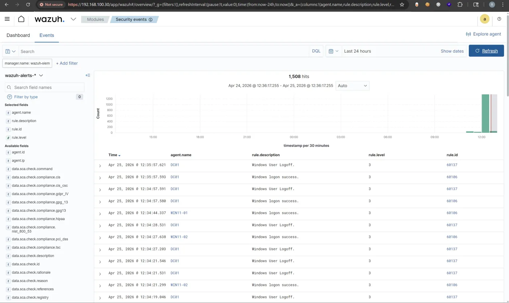

# Attack Scenario 2 — Password Spraying

**MITRE ATT&CK:** T1110.003 — Brute Force: Password Spraying  
**Date:** May 2026  
**Source:** Kali Linux (192.168.100.50)  
**Target:** DC01 — Domain Controller (192.168.100.10)

---

## Objective

Following reconnaissance, the next realistic step for an attacker who lacks valid credentials is to attempt authentication against known or guessed accounts. Password spraying tests a small number of common passwords against many accounts, rather than brute-forcing one account with many passwords — this avoids triggering account lockout policies that key on per-account failure counts.

---

## Attacker Commands

```bash
crackmapexec smb 192.168.100.10 -u administrator -p wrongpassword1
crackmapexec smb 192.168.100.10 -u administrator -p wrongpassword2
crackmapexec smb 192.168.100.10 -u administrator -p wrongpassword3
crackmapexec smb 192.168.100.10 -u administrator -p wrongpassword4
crackmapexec smb 192.168.100.10 -u administrator -p wrongpassword5
```

---

## Result

Each attempt generated a Windows Security **Event ID 4625** (logon failure) on DC01, immediately forwarded to Wazuh via the Sysmon/Windows Event Log channel.

---

## Wazuh Detection

Wazuh fired **Rule ID 60122** on each failed attempt:

| Field | Value |
|---|---|
| Description | Logon failure — Unknown user or bad password |
| Rule level | 5 |
| MITRE techniques | T1078, T1531 |
| MITRE tactics | Defense Evasion, Persistence, Privilege Escalation, Initial Access, Impact |




### Custom Sigma Detection Rule

A custom Sigma rule was authored and validated to correlate repeated authentication failures from a single source host:

```yaml
title: Password Spray via Repeated SMB Logon Failures
id: 7a2c9e1b-5678-4def-9012-3456789abcde
status: stable
description: Detects password spraying via repeated 4625 logon failures against a domain controller from a single source within a short window
references:
  - https://attack.mitre.org/techniques/T1110/003/
tags:
  - attack.credential_access
  - attack.t1110.003
logsource:
  product: windows
  service: security
detection:
  selection:
    EventID: 4625
  timeframe: 5m
  condition: selection | count(IpAddress) by IpAddress > 3
falsepositives:
  - Misconfigured service accounts retrying authentication
  - User with cached incorrect credentials on multiple devices
level: medium
```

Full rule file: [`detection-rules/password-spray.yml`](../../detection-rules/password-spray.yml)

---

### Verification Query (Wazuh / Splunk SPL)

```spl
index=wineventlog EventCode=4625
| stats count by Account_Name, IpAddress, _time
| where count > 3
```

---

## Analysis

The technique deliberately avoids a single account accumulating enough failures to lock out, which is why detection cannot rely on per-account lockout thresholds alone. The meaningful signal is the **source IP**: a single host generating repeated 4625 events against the `administrator` account, or against multiple distinct accounts, in a short window is the actual indicator of a spray rather than ordinary user error.

This is also why Wazuh's automatic MITRE mapping is valuable here — a single rule (60122) maps to five separate tactics depending on context, because a failed logon can represent the early stage of several different attack chains, not just brute force.

---

## Why This Matters

Password spraying is one of the most common real-world initial access techniques precisely because it is quiet against per-account controls. Detecting it requires correlation across accounts and source IPs, not single-event alerting — this is the core value proposition of a SIEM over raw event logs.

---

## Remediation Recommendations

- Alert on any single source IP generating 4625 events against 3 or more distinct accounts within a 5-minute window, regardless of per-account lockout state.
- Enforce account lockout or progressive delay after a small number of failures, tuned to avoid denial-of-service risk against legitimate users.
- Consider geofencing or source-IP allowlisting for direct SMB/Kerberos authentication where VPN or jump-host access is otherwise standard practice.
